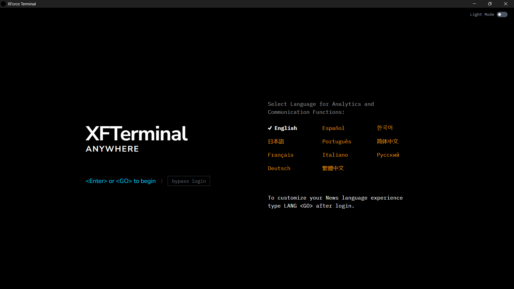
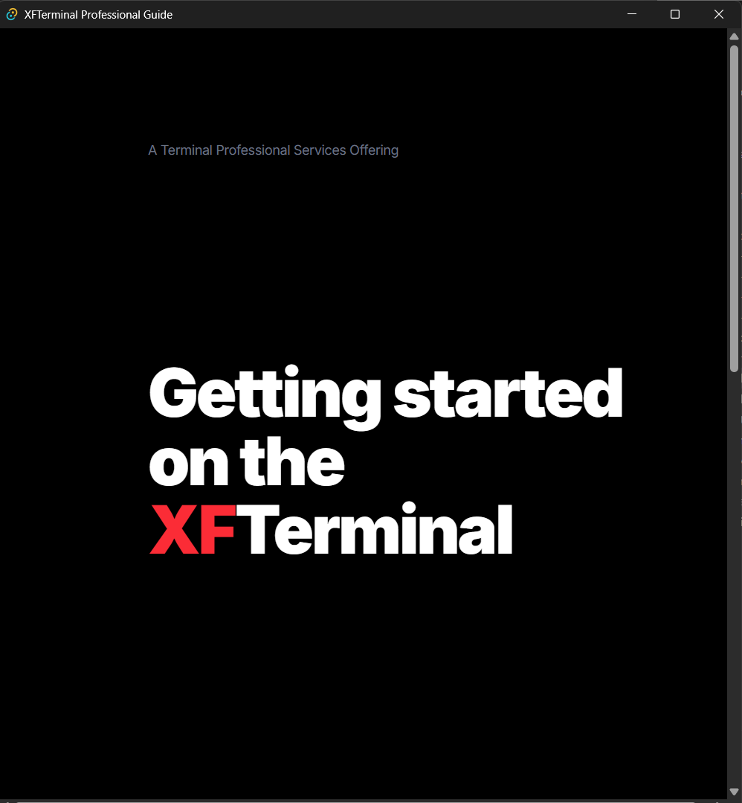

# XForce Platform

A comprehensive Solana DeFi ecosystem consisting of a trading terminal, smart contracts, and crypto news aggregation service.


*The XFTerminal Professional Trading Desktop*


*Integrated Data Streaming and Execution*


## Overview

XForce Platform provides professional-grade tools for Solana DeFi traders, including:

- **XForce Terminal** - Desktop trading terminal with real-time charts and swap execution
- **XForce Terminal Contracts** - Solana smart contracts for batch token swaps
- **XForce Crypto Info** - Crypto news aggregation and analysis service

## Repository Structure

```
xfterminal/
├── README.md                     # This file
├── .gitignore                    # Root gitignore
├── xforce-terminal/              # Desktop terminal & web wallet
│   ├── backend/                  # Axum REST API
│   ├── crates/                   # Rust library crates
│   ├── terminal-tauri/           # Tauri desktop app
│   ├── wallet-react/             # React web wallet
│   ├── docs/                     # HTML documentation
│   ├── idl/                      # Solana IDL files
│   └── migrations/               # Database migrations
├── xforce-terminal-contracts/    # Solana smart contracts
│   ├── programs/                 # Anchor programs
│   ├── client/                   # Rust client library
│   ├── examples/                 # Usage examples
│   ├── tests/                    # Integration tests
│   └── docs/                     # Security docs
└── xforce-crypto-info/           # News aggregation service
    ├── news-web/                 # React frontend
    ├── news-scraper/             # Python scraper
    └── ref/                      # Reference implementations
```

## Projects

### XForce Terminal

Non-custodial Solana DeFi trading platform with desktop terminal, web wallet, and backend API.

**Key Features:**
- Real-time price charts (lightweight-charts)
- Multi-wallet support (Phantom, Solflare, Backpack)
- Jupiter aggregator integration
- WebSocket price feeds
- Bloomberg-style panel layout

**Tech Stack:** Rust (Axum, Tauri), React, TypeScript, PostgreSQL

[See xforce-terminal README](xforce-terminal/README.md)

### XForce Terminal Contracts

Solana smart contracts for batch token swaps.

**Key Features:**
- Batch up to 10 swaps per transaction
- Jupiter integration for optimal routing
- Slippage protection
- Atomic execution

**Devnet Program ID:** `HS63bw1V1qTM5uWf92q3uaFdqogrc4SN9qUJSR8aqBMx`

**Tech Stack:** Rust, Anchor Framework

[See xforce-terminal-contracts README](xforce-terminal-contracts/README.md)

### XForce Crypto Info

Crypto news aggregation service with sentiment analysis.

**Key Features:**
- RSS feed aggregation from 10+ sources
- Sentiment analysis using NLTK/VADER
- PostgreSQL storage
- React dashboard
- Real-time updates

**Tech Stack:** Python, React, TypeScript, PostgreSQL

[See xforce-crypto-info README](xforce-crypto-info/README.md)

## Quick Start

### Prerequisites
- Rust 1.70+
- Node.js 18+
- Python 3.9+
- PostgreSQL 14+
- Solana CLI (optional)

### Running XForce Terminal

```bash
cd xforce-terminal/backend
cargo run  # Starts API at http://localhost:8080

cd ../terminal-tauri/src-ui
npm install
cd ..
cargo tauri dev  # Starts desktop terminal
```

### Running XForce Terminal Contracts

```bash
cd xforce-terminal-contracts
anchor build
anchor test
anchor deploy --provider.cluster devnet
```

### Running XForce Crypto Info

```bash
cd xforce-crypto-info/news-scraper
pip install -r requirements.txt
python main.py

cd ../news-web
npm install
npm run dev  # http://localhost:5173
```

## Development

Each project can be developed independently. See individual README files for detailed development instructions.

## Documentation

Every folder contains a comprehensive README with:
- Project structure
- Feature descriptions
- Setup instructions
- API documentation
- Usage examples

Total: 35+ README files across all projects.

## License

Apache-2.0 / MIT - See individual project LICENSE files

## Contributing

1. Fork the repository
2. Create a feature branch
3. Commit your changes
4. Push to the branch
5. Create a Pull Request

## Security

This platform handles cryptocurrency transactions. Always:
- Review code before deploying
- Test on devnet before mainnet
- Keep private keys secure
- Use hardware wallets when possible
