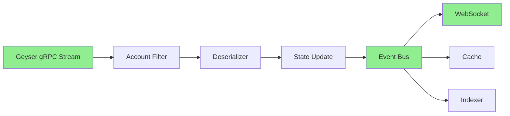

# Geyser Implementation Skills for XForce Terminal

## Overview

This document outlines the **specific skills required and gained** when implementing Geyser event-driven architecture in XForce Terminal.

**Project**: Add Geyser gRPC streaming to XForce Terminal for real-time on-chain data  
**Skill Acquired**: "Experience building event-driven architectures on top of Geyser"  
**Priority**: HIGH - Listed in job description bonuses, provides competitive advantage

---

## Pre-Requisite Skills (Already Have)

### From XForce Terminal
| Skill | Evidence | Transferability |
|-------|----------|-----------------|
| **Async Rust** | `price_stream.rs` with tokio broadcast | ✅ Direct - same patterns |
| **WebSocket Streaming** | Real-time price updates | ✅ Similar streaming concepts |
| **Solana RPC** | `client.rs` with `RpcClient` | ✅ Foundation for Geyser |
| **Account Handling** | `spl_token.rs` parsing | ✅ Account data knowledge |

### From Braid Protocol Work
| Skill | Evidence | Transferability |
|-------|----------|-----------------|
| **gRPC** | HTTP/3 over Iroh | ✅ Direct - Geyser uses gRPC |
| **P2P Networking** | Braid_iroh implementation | ✅ Streaming patterns |
| **Protocol Buffers** | IETF spec implementation | ✅ Geyser uses protobuf |

### From Soroban/yew-scaffold
| Skill | Evidence | Transferability |
|-------|----------|-----------------|
| **Event Streaming** | `events.rs` in soroban services | ✅ Event-driven patterns |
| **Real-time Data** | Event filtering/pagination | ✅ Similar architecture |

---

## New Skills to Learn

### 1. Geyser gRPC Client Integration

**What to Learn:**
- `yellowstone-grpc` client library
- Geyser protobuf definitions
- gRPC streaming with tonic
- Connection management and reconnection

**Implementation:**
```rust
use yellowstone_grpc_client::GeyserGrpcClient;
use yellowstone_grpc_proto::geyser::{
    SubscribeRequest, SubscribeUpdate, 
    CommitmentLevel, subscribe_update::UpdateOneof
};

pub struct GeyserClient {
    client: GeyserGrpcClient<impl Connect>,
    subscriptions: Vec<Subscription>,
}

impl GeyserClient {
    pub async fn connect(endpoint: &str) -> Result<Self> {
        let client = GeyserGrpcClient::connect(endpoint, None, None).await?;
        Ok(Self { client, subscriptions: vec![] })
    }
}
```

**Skill Level**: Intermediate  
**Time to Learn**: 1-2 days  
**Resources**:
- [yellowstone-grpc crate](https://docs.rs/yellowstone-grpc-client)
- Solana Labs Geyser documentation

---

### 2. Account Subscription Management

**What to Learn:**
- Account discriminator parsing
- Data deserialization with Borsh
- Subscription lifecycle (subscribe/unsubscribe)
- Account update filtering

**Implementation:**
```rust
pub struct AccountSubscription {
    pubkey: Pubkey,
    discriminator: [u8; 8],
    handler: Box<dyn Fn(AccountUpdate) + Send + Sync>,
}

impl GeyserPriceStream {
    pub async fn subscribe_price_accounts(&mut self, oracles: &[Pubkey]) {
        for oracle in oracles {
            let subscription = self.geyser_client.subscribe_account(oracle).await;
            
            tokio::spawn(async move {
                while let Some(update) = subscription.next().await {
                    // Parse account data
                    if let Ok(price_data) = parse_price_account(&update.data) {
                        // Broadcast to WebSocket
                        self.broadcast(price_data);
                    }
                }
            });
        }
    }
    
    fn parse_price_account(data: &[u8]) -> Result<PriceData> {
        // Check discriminator
        let discriminator = &data[0..8];
        if discriminator != PRICE_ACCOUNT_DISCRIMINATOR {
            return Err(Error::InvalidAccountType);
        }
        // Deserialize with Borsh
        PriceData::try_from_slice(&data[8..])
    }
}
```

**Skill Level**: Intermediate  
**Time to Learn**: 2-3 days  
**Key Concepts**:
- Account discriminators (first 8 bytes)
- Borsh deserialization
- Stream processing with tokio

---

### 3. Transaction Filtering and Parsing

**What to Learn:**
- Transaction structure (instructions, accounts, meta)
- Program ID filtering
- Instruction discriminator parsing
- Transaction confirmation monitoring

**Implementation:**
```rust
pub struct TransactionMonitor {
    filters: Vec<TransactionFilter>,
    handlers: HashMap<ProgramId, TransactionHandler>,
}

pub enum TransactionFilter {
    ProgramId(Pubkey),
    AccountOwner(Pubkey),
    Instruction discriminator([u8; 8]),
}

impl TransactionMonitor {
    pub async fn monitor_program_transactions(&self, program_id: Pubkey) {
        let stream = self.geyser_client.subscribe_transactions(
            SubscribeRequestFilterTransactions {
                vote: Some(false),
                failed: Some(false),
                account_include: vec![program_id.to_string()],
                ..Default::default()
            }
        ).await;
        
        tokio::spawn(async move {
            while let Some(update) = stream.next().await {
                if let UpdateOneof::Transaction(tx) = update.update_oneof {
                    self.process_transaction(tx).await;
                }
            }
        });
    }
    
    async fn process_transaction(&self, tx: SubscribeUpdateTransaction) {
        // Check if this is a batch swap
        if let Some(batch_swap) = self.parse_batch_swap(&tx) {
            // Notify clients
            self.notify_swap_completion(batch_swap.signature);
        }
    }
}
```

**Skill Level**: Advanced  
**Time to Learn**: 3-5 days  
**Use Cases for XForce Terminal**:
- Monitor batch swap execution
- Track user transactions in real-time
- Detect MEV patterns

---

### 4. Event-Driven State Updates

**What to Learn:**
- Event sourcing patterns
- State reconciliation
- Event bus architecture
- Conflict resolution

**Implementation:**
```rust
pub struct EventDrivenCache {
    geyser_events: mpsc::Receiver<AccountUpdate>,
    state: Arc<RwLock<HashMap<Pubkey, AccountData>>>,
    event_bus: broadcast::Sender<CacheEvent>,
}

impl EventDrivenCache {
    pub async fn run(&self) {
        while let Some(update) = self.geyser_events.recv().await {
            // Update state
            let mut state = self.state.write().await;
            state.insert(update.pubkey, update.data.clone());
            drop(state);
            
            // Broadcast event
            self.event_bus.send(CacheEvent::AccountUpdated {
                pubkey: update.pubkey,
                data: update.data,
            }).ok();
        }
    }
}
```

**Skill Level**: Intermediate  
**Time to Learn**: 2-3 days  
**Existing Foundation**: `cache.rs` with TTL - extend to event-driven

---

### 5. Real-Time Data Pipeline Architecture

**What to Learn:**
- Pipeline design patterns
- Backpressure handling
- Buffer management
- Error recovery

**Architecture:**


**Implementation:**
```rust
pub struct DataPipeline {
    stages: Vec<Box<dyn PipelineStage>>,
    buffer: mpsc::Channel<PipelineEvent>,
    metrics: PipelineMetrics,
}

#[async_trait]
pub trait PipelineStage: Send + Sync {
    async fn process(&self, event: PipelineEvent) -> Result<PipelineEvent>;
}

// Stages:
// 1. GeyserSource - Stream from Geyser
// 2. FilterStage - Filter relevant accounts
// 3. DeserializeStage - Parse account data
// 4. UpdateStage - Update internal state
// 5. BroadcastStage - Send to WebSocket clients
```

**Skill Level**: Advanced  
**Time to Learn**: 5-7 days  
**Foundation**: Existing `price_stream.rs` pipeline

---

## Implementation Roadmap

### Phase 1: Foundation (Week 1)
**Goal**: Basic Geyser connection and account streaming

**Tasks**:
1. Add `yellowstone-grpc` dependency
2. Implement Geyser client wrapper
3. Subscribe to single oracle account
4. Parse account data
5. Log updates

**Skills Gained**:
- Geyser client setup
- gRPC streaming basics
- Account data parsing

**Deliverable**: Proof-of-concept streaming one price account

---

### Phase 2: Integration (Week 2)
**Goal**: Integrate with existing price stream

**Tasks**:
1. Create `geyser_price_stream.rs` module
2. Implement hybrid approach (Geyser + Jupiter fallback)
3. Handle reconnection logic
4. Add error handling
5. Update WebSocket broadcast

**Skills Gained**:
- Hybrid architecture patterns
- Fallback mechanisms
- Resilient streaming

**Deliverable**: Price stream with Geyser primary, Jupiter backup

---

### Phase 3: Transaction Monitoring (Week 3)
**Goal**: Real-time transaction confirmation

**Tasks**:
1. Subscribe to batch swap program transactions
2. Parse transaction for swap events
3. Notify clients of confirmation
4. Update UI in real-time

**Skills Gained**:
- Transaction parsing
- Event detection
- Real-time notifications

**Deliverable**: Instant swap confirmation notifications

---

### Phase 4: Production Hardening (Week 4)
**Goal**: Production-ready implementation

**Tasks**:
1. Add metrics and monitoring
2. Implement circuit breakers
3. Add rate limiting
4. Write comprehensive tests
5. Document architecture

**Skills Gained**:
- Production streaming systems
- Observability
- Testing gRPC services

**Deliverable**: Deployed Geyser integration

---

## Skills Summary

### Pre-Requisites (Already Have)
- ✅ Async Rust (tokio, streams)
- ✅ gRPC experience
- ✅ Solana development
- ✅ WebSocket streaming
- ✅ Event-driven patterns (Soroban)

### New Skills (To Learn)
- 🎯 Geyser gRPC client
- 🎯 Account subscription management
- 🎯 Transaction filtering
- 🎯 Real-time data pipelines
- 🎯 Event sourcing

### Total Learning Time
**4-6 weeks** for full implementation (with existing foundation)

---

## Job Skill Value

### Why This Skill Matters

| Aspect | Value |
|--------|-------|
| **Rarity** | Few Solana developers have Geyser experience |
| **Demand** | High for indexers, MEV bots, real-time apps |
| **Compensation** | Premium for Geyser expertise |
| **Career Path** | Protocol engineer, infrastructure, MEV |

### Comparable Skills

Geyser expertise is similar to:
- Ethereum subgraph development
- Kafka streaming expertise
- Real-time data pipeline engineering
- Blockchain indexing

### Companies Using Geyser

- **Jupiter** - Price feeds
- **Phantom** - Wallet updates
- **Helius** - Indexing infrastructure
- **SolanaFM** - Explorer

---

## Resources

### Official
- [Solana Geyser Documentation](https://docs.solana.com/developing/plugins/geyser-plugins)
- [yellowstone-grpc GitHub](https://github.com/rpcpool/yellowstone-grpc)

### Community
- Solana Tech Discord #geyser channel
- Yellowstone RPC Pool documentation

### Code Examples
- Jupiter Geyser integration
- Helius webhook implementation

---

## Next Steps

1. **Start with Phase 1** - Basic Geyser connection
2. **Join Solana Discord** - #geyser channel for support
3. **Study Jupiter's implementation** - Open source reference
4. **Add to resume** - "Experience building event-driven architectures on top of Geyser"

---

**Estimated Total Implementation Time**: 4-6 weeks  
**Skill Acquisition**: High-value, rare expertise  
**Career Impact**: Significant differentiator for Solana roles
