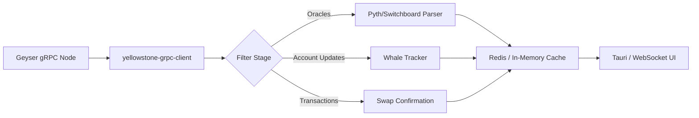

# XFTerminal Master Implementation Plan: SVM Optimization & Real-Time Data

## Executive Summary
This master plan outlines the strategic evolution of the XFTerminal from a standard trading interface to an institutional-grade, low-latency execution platform. By integrating **Pinocchio** (a lightweight, zero-copy SVM framework) and **Geyser** (high-performance gRPC data streaming), we will achieve unparalleled performance in trade execution and market data delivery.

---

## Part 1: High-Performance On-Chain Logic (Pinocchio)

### 1.1 Architectural Shift
Traditional Anchor programs are excellent for developer velocity but introduce overhead. For XFTerminal's high-frequency trading (HFT) modules, we are migrating to a "Hybrid SVM" model.

| Feature | Anchor (Standard) | Pinocchio (High-Performance) |
|---------|-------------------|-----------------------------|
| **Compute Units** | High (Framework overhead) | Minimal (Direct syscalls) |
| **Parsing** | Serialized (Copying) | Zero-copy (Direct access) |
| **Dependencies** | Full Solana SDK | `no_std` (Zero external deps) |

### 1.2 Target Components for Pinocchio
1.  **Batch Swap Router**: Rewrite the inner loop of the swap router using `pinocchio-token` to save ~4,000 Compute Units per hop.
2.  **Instruction Guard**: Implement a `lazy_program_entrypoint` to validate instruction discriminators before any account parsing, allowing for ultra-fast rejection of invalid trades.
3.  **Compute Budget Manager**: A dedicated Pinocchio-based helper to calculate exact CU requirements on-chain, preventing over-payment of priority fees.

---

## Part 2: Real-Time Data Infrastructure (Geyser)

### 2.1 Moving Beyond RPC Polling
Polling the Solana RPC for price updates is insufficient for professional trading. We are implementing an event-driven architecture powered by **Yellowstone Geyser gRPC**.

### 2.2 Data Pipeline Design

### 2.3 Key Implementation Milestones
- **State Reconciliation**: Implementing a local "shadow-state" of relevant liquidity pools, updated in real-time via Geyser Account Updates.
- **Micro-Indexing**: Instead of full-node indexing, XFTerminal will index only its user-relevant accounts (positions, wagers, limit orders) for sub-millisecond UI updates.

---

## Part 3: Technical Execution Roadmap

### Phase 1: SVL (Solana Vital Layer) - Week 1-2
- **Objective**: Establish the gRPC bridge.
- **Action**: Implement the `GeyserClient` crate in `crates/libs/lib-solana`.
- **Deliverable**: Real-time ticker in the terminal console powered by Geyser.

### Phase 2: Zero-Cost Execution - Week 3-4
- **Objective**: Deploy the first Pinocchio optimized program.
- **Action**: Rewrite `batch-swap-router` CUs bottleneck with `pinocchio-token`.
- **Deliverable**: 30% reduction in transaction fees for terminal users.

### Phase 3: The "Glass Window" Dashboard - Week 5-6
- **Objective**: Total UI synchronization.
- **Action**: Connect Geyser Transaction streams to the Tauri frontend.
- **Deliverable**: "Instant-Conf" UI where trades appear confirmed before the RPC even returns success.

---

## Part 4: Risk and Mitigation

### 4.1 Dependency Complexity
- **Risk**: Pinocchio's `no_std` environment requires manual memory management.
- **Mitigation**: Implement strict unit tests using the `pinocchio-test` framework to prevent memory leaks or overflows.

### 4.2 Network Instability
- **Risk**: gRPC streams can drop during network congestion.
- **Mitigation**: Implement an "Automatic Failover" to standard RPC polling (Helius) if the Geyser stream latency exceeds 500ms.

---

## Part 5: Conclusion
This plan positions XFTerminal as the most technically advanced terminal in the Solana ecosystem. By owning the full stack from the high-performance Rust backend to the optimized on-chain programs, we provide users with the "Bloomberg" experience: speed, precision, and reliability.
