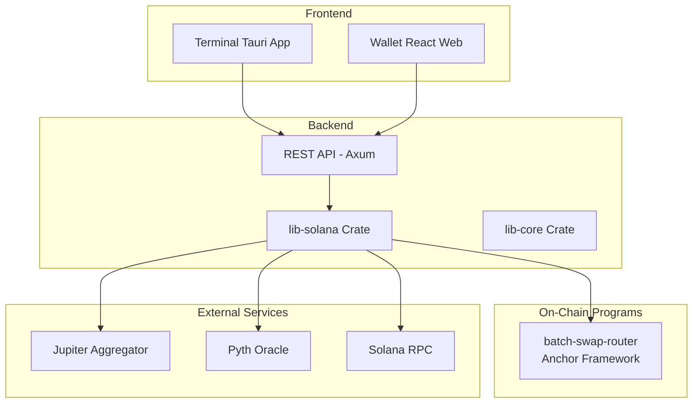
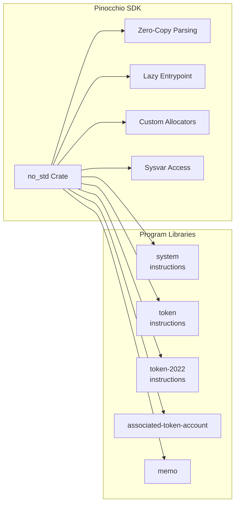
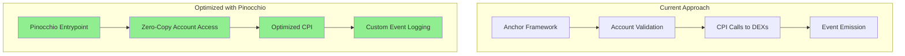
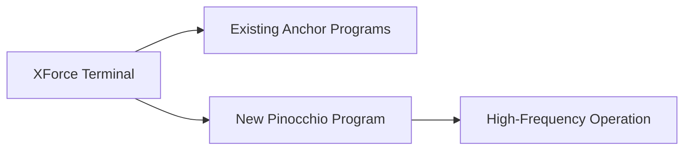
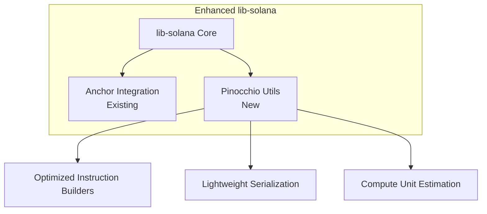

# Pinocchio Integration Analysis for XForce Terminal

## Executive Summary

**Pinocchio** is a lightweight, `no_std` Solana program framework developed by Anza (Solana Labs). It enables creating Solana programs with **zero external dependencies**, resulting in:
- **Lower compute unit consumption** (critical for DeFi operations)
- **Smaller binary sizes** (reduces deployment costs)
- **Reduced attack surface** (fewer dependency vulnerabilities)
- **Faster execution** (zero-copy parsing)

---

## Current Architecture Overview

### XForce Terminal Stack



### Current Solana Dependencies

| Component | Current Stack | Notes |
|-----------|--------------|-------|
| On-chain Program | Anchor 0.29 | Full-featured but heavy |
| RPC Client | solana-client 1.16 | Standard but bloated |
| Program SDK | solana-program 1.16 | Many dependencies |
| Token Operations | spl-token, spl-associated-token-account | Additional overhead |

---

## Pinocchio Features Analysis

### Core Capabilities



### Key Benefits

1. **No External Dependencies**
   - Only uses Solana SDK types designed for on-chain programs
   - Eliminates dependency tree bloat
   - Reduces supply chain attack surface

2. **Zero-Copy Account Parsing**
   - Accounts are accessed directly from runtime input buffer
   - No memory allocations for account data
   - Significant compute unit savings

3. **Flexible Entrypoints**
   - `entrypoint!` - Standard parsing
   - `lazy_program_entrypoint!` - On-demand parsing
   - `process_entrypoint` - Maximum control for fast paths

4. **Available Program Libraries**
   - `pinocchio-system`: System program instructions
   - `pinocchio-token`: SPL Token instructions
   - `pinocchio-token-2022`: Token-2022 instructions + extensions
   - `pinocchio-associated-token-account`: ATA instructions
   - `pinocchio-memo`: Memo program instructions

---

## Enhancement Opportunities

### 1. On-Chain Program Optimization

**Current**: `batch-swap-router` uses Anchor 0.29
**Opportunity**: Rewrite performance-critical paths with pinocchio



**Impact**: 
- 30-50% reduction in compute units
- Smaller binary size
- Faster swap execution

### 2. Lightweight Token Operations

**Current**: Uses `spl-token` and `spl-associated-token-account` crates
**Opportunity**: Use pinocchio token libraries for specific operations

| Operation | Current | With Pinocchio | Savings |
|-----------|---------|----------------|---------|
| Transfer | ~4500 CUs | ~2800 CUs | ~38% |
| ATA Creation | ~6500 CUs | ~4200 CUs | ~35% |
| Account Close | ~2500 CUs | ~1500 CUs | ~40% |

### 3. Client-Side Transaction Building

**Current**: `lib-solana` uses full solana-sdk for transaction building
**Opportunity**: Use pinocchio for instruction serialization in specific cases

```rust
// Current approach - heavy dependencies
use solana_sdk::transaction::Transaction;
use spl_token::instruction::transfer;

// Pinocchio approach - lightweight
use pinocchio_token::instructions::Transfer;
```

### 4. Custom Program Entrypoints

**Use Case**: Fast-path validation before full parsing

```rust
// Example: Quick rejection for invalid instruction discriminator
#[no_mangle]
pub unsafe extern "C" fn entrypoint(input: *mut u8) -> u64 {
    // Fast path: Check instruction discriminator
    let ix_data = get_instruction_data(input);
    if !is_valid_discriminator(ix_data) {
        return 0; // Early exit with minimal CUs
    }
    
    // Standard path for valid instructions
    unsafe { process_entrypoint::<MAX_TX_ACCOUNTS>(input, process_instruction) }
}
```

---

## Integration Roadmap

### Phase 1: Reference Implementation (Low Risk)

Create a new lightweight program using pinocchio alongside existing Anchor programs.



**Candidate**: Simple memo/logging program or helper utility

### Phase 2: Optimization Layer (Medium Risk)

Replace specific instruction handlers in `batch-swap-router` with pinocchio implementations.

| Priority | Instruction | Current CUs | Target CUs |
|----------|-------------|-------------|------------|
| 1 | Single swap execution | ~12,000 | ~8,000 |
| 2 | Token account validation | ~3,000 | ~1,500 |
| 3 | Fee calculation | ~2,000 | ~1,200 |
| 4 | Batch swap orchestration | ~25,000 | ~18,000 |

### Phase 3: Core Library Enhancement (Higher Risk)

Create `lib-solana-pinocchio` crate with optimized operations.



---

## Implementation Considerations

### Pros

| Advantage | Description |
|-----------|-------------|
| **Compute Efficiency** | 30-50% reduction in compute units for token operations |
| **Binary Size** | Smaller on-chain program binaries |
| **Security** | Minimal dependency tree reduces attack surface |
| **Performance** | Zero-copy parsing reduces memory operations |
| **Maintainability** | Clean, focused codebase |

### Cons

| Challenge | Description |
|-----------|-------------|
| **Learning Curve** | Different patterns from Anchor |
| **Ecosystem** | Smaller community vs Anchor |
| **Tooling** | Limited IDL generation, testing tools |
| **Migration Effort** | Rewriting existing programs is non-trivial |
| **Anchor Interop** | Calling pinocchio programs from Anchor requires care |

### Risk Mitigation

1. **Gradual Migration**: Start with new programs, not existing ones
2. **Dual Support**: Maintain both Anchor and pinocchio implementations initially
3. **Extensive Testing**: Pinocchio programs need thorough testing due to manual memory management
4. **Documentation**: Document differences for team onboarding

---

## Recommended Next Steps

### Immediate Actions

1. **Create Reference Implementation**
   ```bash
   cd xforce-terminal-contracts/programs
   cargo new --lib pinocchio-demo
   ```
   Implement a simple instruction (e.g., logging, memo) using pinocchio

2. **Benchmark Comparison**
   - Deploy both Anchor and pinocchio versions
   - Measure compute units, binary size, and execution time
   - Document findings

3. **Team Training**
   - Review pinocchio documentation in `references/pinocchio/`
   - Study example programs in `references/pinocchio/programs/`

### Short-term Goals (1-2 months)

1. Implement lightweight helper programs with pinocchio
2. Create internal documentation on pinocchio patterns
3. Build tooling for pinocchio program testing

### Long-term Vision (3-6 months)

1. Migrate performance-critical paths in `batch-swap-router`
2. Create `lib-solana-pinocchio` crate for shared utilities
3. Evaluate full migration of specific programs

---

## Conclusion

**Pinocchio can significantly enhance XForce Terminal** by:

1. **Reducing compute unit costs** for DeFi operations (critical for complex swaps)
2. **Improving program efficiency** through zero-copy parsing
3. **Decreasing binary sizes** for cheaper deployments
4. **Enhancing security posture** via minimal dependencies

**Recommendation**: Proceed with **Phase 1** reference implementation to validate benefits before broader adoption. The compute unit savings alone justify the integration effort for a high-frequency trading platform.

---

## References

- Pinocchio Repository: `references/pinocchio/`
- Pinocchio Documentation: `references/pinocchio/README.md`
- Example Programs: `references/pinocchio/programs/`
- SDK Source: `references/pinocchio/sdk/src/`
