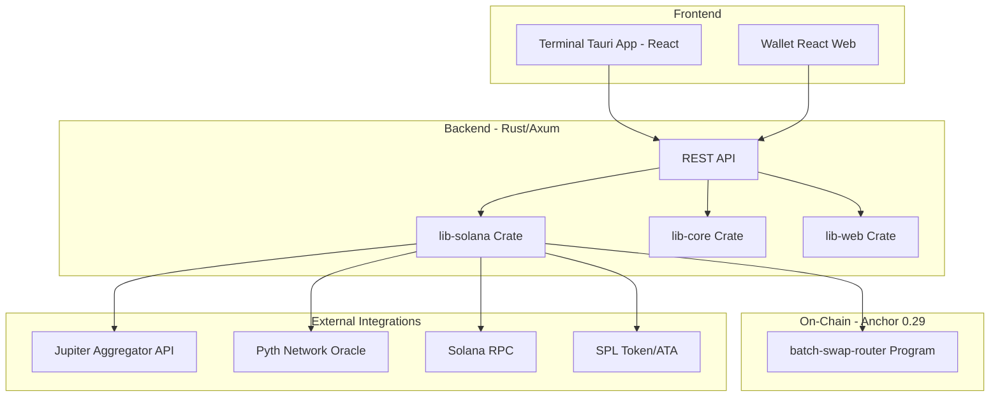
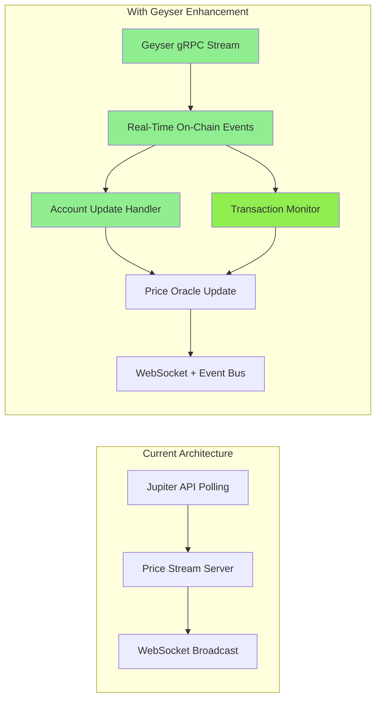

# XForce Terminal - Current Implementation Skills Analysis

## Overview

XForce Terminal is a non-custodial Solana DeFi trading platform with a Tauri+React desktop app, backend API, and on-chain programs. This document maps the currently implemented features to required skills.

---

## Architecture Summary



---

## Existing no_std Experience (Soroban/Stellar)

**Repositories:**
- [`trilltino/stellarheads`](https://github.com/trilltino/stellarheads) - Game leaderboard contract
- [`trilltino/yew-scaffold`](https://github.com/trilltino/yew-scaffold) - Enterprise Soroban infrastructure

### Soroban Contract Experience (`stellarheads/contract/`)

```rust
// stellarheads/contract/src/lib.rs
#![no_std]

use soroban_sdk::{
    contract, contractimpl, contracttype, contracterror,
    Address, Env, Map, Vec, log, Symbol
};
```

| Feature | Implementation |
|---------|---------------|
| **no_std Contract** | `#![no_std]` with Soroban SDK v22.0.1 |
| **Contract Errors** | `#[contracterror]` custom error enums |
| **Data Types** | `#[contracttype]` for storage structs |
| **Authorization** | `player.require_auth()` pattern |
| **Events** | `env.events().publish()` for indexing |
| **Storage** | `env.storage().persistent()` with `Map`/`Vec` |
| **Logging** | `log!()` macro for debugging |

**Key Skills Demonstrated:**
- `no_std` Rust programming in production
- Contract state management without heap allocations
- Event emission patterns
- Address-based authorization
- Persistent storage patterns

### Soroban Infrastructure Services (`yew-scaffold/backend/src/services/soroban/`)

| Module | Capability |
|--------|------------|
| `client.rs` (32KB) | XDR generation, transaction building, RPC interaction |
| `manager.rs` (28KB) | Scalable contract manager with circuit breakers |
| `registry.rs` (12KB) | Contract registry with metadata |
| `cache.rs` | Contract-level caching layer |
| `circuit_breaker.rs` | Failure protection patterns |
| `pool.rs` | RPC connection pooling |
| `queue.rs` | Async operation queuing |
| `events.rs` | Event filtering and pagination |
| `simulation.rs` | Transaction simulation |
| `state.rs` | Ledger entry management |

**Key Capabilities:**
- Enterprise-grade Soroban RPC infrastructure
- Connection pooling and load balancing
- Circuit breaker patterns for resilience
- XDR encoding/decoding
- Transaction simulation before submission
- Event streaming and filtering

### Skills Transfer to Pinocchio

| Soroban Skill | Pinocchio Equivalent | Transferability |
|---------------|---------------------|-----------------|
| `no_std` programming | `no_std` programming | ✅ Direct |
| Contract state (`Map`/`Vec`) | Manual serialization | ⚠️ Adaptation needed |
| `Env` context | `AccountView`/`Address` | ⚠️ Different API |
| `require_auth()` | Signer validation | ✅ Similar pattern |
| Event emission | Manual logging/events | ✅ Similar concept |
| Persistent storage | Account data | ⚠️ Different model |
| XDR handling | Instruction data | ⚠️ Different format |

---

## Currently Implemented Features

### 1. Solana RPC Client (`lib-solana/src/client.rs`)
**Status**: ✅ Implemented

| Feature | Description |
|---------|-------------|
| Multi-network support | Mainnet, Devnet with Helius API integration |
| Async RPC client | `solana_client::nonblocking::rpc_client::RpcClient` |
| Account fetching | `get_account()` with Pubkey |
| Epoch info tracking | `get_epoch_info()` for stake-related operations |
| Transaction sending | `send_and_confirm_transaction()` |
| Blockhash management | `get_latest_blockhash()` |
| Transaction history | `get_signatures_for_address()` |
| Health checks | `health_check()` for service monitoring |

**Skills Demonstrated**:
- Solana account model understanding (Pubkey, Account, Epoch)
- RPC client patterns (nonblocking async)
- Transaction lifecycle management
- Network configuration management

---

### 2. Jupiter Aggregator Integration (`lib-solana/src/jupiter/`)
**Status**: ✅ Implemented

| Module | Feature | Description |
|--------|---------|-------------|
| `client.rs` | HTTP client | `reqwest`-based Jupiter API client |
| `quote.rs` | Swap quotes | Fetch swap routes and pricing |
| `swap.rs` | Transaction building | Build swap transactions |
| `price.rs` | Token prices | Real-time price fetching |
| `types.rs` | Data models | Jupiter API response types |

**Features**:
- Token list loading with retry logic
- Price API integration (Jupiter Price API v6)
- Swap instruction building
- Token metadata caching

**Skills Demonstrated**:
- DeFi aggregation protocols
- HTTP API integration patterns
- Token price oracle concepts
- Retry logic with exponential backoff

---

### 3. Pyth Network Oracle (`lib-solana/src/pyth.rs`)
**Status**: ✅ Implemented

| Feature | Description |
|---------|-------------|
| Hermes API client | HTTP client for Pyth price feeds |
| Price feed mapping | Symbol to Pyth price feed ID conversion |
| Confidence intervals | Price quality metadata |
| EMA price tracking | Smoothed price data |

**Supported Assets**: SOL, BTC, ETH, USDC, BONK, JUP, PYTH, RENDER, WIF, HNT

**Skills Demonstrated**:
- Oracle integration patterns
- Price feed aggregation
- Confidence/quality metrics for financial data

---

### 4. Price Streaming Service (`lib-solana/src/price_stream.rs`)
**Status**: ✅ Implemented

| Feature | Description |
|---------|-------------|
| WebSocket server | Real-time price streaming |
| Broadcast channels | `tokio::sync::broadcast` for multi-client support |
| Polling mechanism | 500ms-1s polling of Jupiter API |
| Automatic reconnection | Retry logic for API failures |
| Rate limiting | Respects Jupiter API limits |

**Skills Demonstrated**:
- Async streaming patterns
- Broadcast channel patterns
- WebSocket server architecture
- Rate limiting implementation

---

### 5. Price Caching (`lib-solana/src/cache.rs`)
**Status**: ✅ Implemented

| Feature | Description |
|---------|-------------|
| TTL-based caching | Configurable cache expiration |
| Multi-source fallback | Pyth → Jupiter → Mock |
| Thread-safe access | `RwLock` for concurrent reads/writes |
| Background refresh | Automatic cache updates |

**Skills Demonstrated**:
- Caching strategies (TTL, LRU patterns)
- Fallback chain patterns
- Concurrent data structures
- Cache invalidation strategies

---

### 6. Candlestick Aggregation (`lib-solana/src/candle_aggregator.rs`)
**Status**: ✅ Implemented

| Feature | Description |
|---------|-------------|
| OHLC data | Open, High, Low, Close calculation |
| Multiple timeframes | 1m, 5m, 15m, 1h, 4h, 1d |
| Volume tracking | Approximated from update frequency |
| Historical storage | 500 candles per timeframe |

**Skills Demonstrated**:
- Financial data aggregation
- Time-series data structures
- OHLC calculation algorithms

---

### 7. SPL Token Operations (`lib-solana/src/spl_token.rs`)
**Status**: ✅ Implemented

| Feature | Description |
|---------|-------------|
| Token account parsing | `spl_token` state deserialization |
| ATA creation | Associated token account instructions |
| Balance checking | Token account balance queries |
| Transfer instructions | SPL token transfer building |

**Skills Demonstrated**:
- SPL Token standard
- Associated Token Accounts (ATA)
- Token account state parsing

---

### 8. Transaction Builder (`lib-solana/src/contracts/transaction_builder.rs`)
**Status**: ✅ Implemented

| Feature | Description |
|---------|-------------|
| IDL handling | Anchor IDL parsing and loading |
| Jupiter TX decoding | Base64 transaction decoding |
| Instruction building | AccountMeta and Instruction construction |
| Transaction composition | Combining multiple instructions |

**Skills Demonstrated**:
- Transaction structure (Instructions, Accounts, Signers)
- Anchor IDL format
- Base64 encoding/decoding
- Solana transaction lifecycle

---

### 9. Batch Swap Router Program (`xforce-terminal-contracts/programs/batch-swap-router/`)
**Status**: ✅ Implemented (Anchor 0.29)

| Module | Description |
|--------|-------------|
| `lib.rs` | Program entry point, instruction routing |
| `instructions/batch_swap.rs` | Batch swap handler |
| `instructions/execute_swap.rs` | Single swap execution |
| `state.rs` | Account structures, SwapParams |
| `errors.rs` | Custom error codes |
| `events.rs` | Event emission for indexing |
| `security.rs` | SafeMath, validation helpers |
| `constants.rs` | Program constants (MAX_BATCH_SIZE=10) |
| `swap_execution.rs` | Fee calculation, swap logic |

**Features**:
- Batch swap execution (up to 10 swaps/tx)
- Atomic execution (all-or-nothing)
- Slippage protection
- Protocol fee calculation
- Security validations (SafeMath, bounds checking)

**Skills Demonstrated**:
- Anchor framework (Accounts, Context, Errors, Events)
- Program Derived Addresses (PDAs)
- Cross-Program Invocation (CPI) patterns
- Account validation patterns
- Event emission for off-chain indexing

---

### 10. Contract Registry & Plugin System (`lib-solana/src/contracts/`)
**Status**: ✅ Implemented

| Module | Description |
|--------|-------------|
| `registry.rs` | Program ID registry |
| `loader.rs` | Dynamic contract loading |
| `plugin.rs` | Plugin trait system |
| `idl_handler.rs` | IDL parsing and validation |

**Skills Demonstrated**:
- Plugin architecture patterns
- Dynamic loading patterns
- Registry pattern implementation
- Trait-based abstractions

---

## Skills Matrix - Current State

### Must Have Skills (Currently Utilized)

| Skill | Level | Evidence |
|-------|-------|----------|
| **Rust** | Advanced | Full async codebase, complex generics, trait systems |
| **Solana Development** | Advanced | Anchor programs, CPI, PDAs, account validation |
| **Account Model** | Advanced | PDA derivation, account validation, ownership checks |
| **SPL Token** | Advanced | Token transfers, ATA creation, account parsing |
| **Async Rust** | Advanced | Tokio, async/await, channels (broadcast, mpsc, RwLock) |
| **Blockchain RPC** | Advanced | `solana_client`, custom RPC client, gRPC ready |
| **Transaction Debugging** | Intermediate | CU awareness, transaction size tracking |
| **Testing** | Intermediate | Unit tests, integration tests in contract codebase |
| **`no_std` Programming** | Advanced | Soroban contracts, `stellarheads` production code |
| **Smart Contract (WASM)** | Advanced | Soroban SDK, contract architecture |
| **XDR Encoding** | Intermediate | Soroban transaction building, `yew-scaffold` services |

### Nice to Have Skills (Currently Utilized)

| Skill | Level | Evidence |
|-------|-------|----------|
| **Anchor Framework** | Advanced | Complete program with full feature set |
| **DeFi Protocols** | Advanced | Jupiter integration, swap routing |
| **Price Oracles** | Intermediate | Pyth Network integration |
| **Soroban SDK** | Advanced | `stellarheads` contract, `yew-scaffold` infrastructure |
| **Stellar Development** | Advanced | XDR handling, RPC infrastructure, enterprise patterns |
| **Circuit Breakers** | Intermediate | `yew-scaffold` resilience patterns |
| **Connection Pooling** | Intermediate | RPC pool management in Soroban services |
| **CI/CD** | Basic | Standard Rust project structure |

### Bonus Skills (Not Currently Utilized)

| Skill | Status | Notes |
|-------|--------|-------|
| **Smart Contract Audit** | ❌ Not used | Security review by external auditors |
| **VRF Oracles** | ❌ Not used | ORAO or similar randomness not implemented |
| **Geyser** | ❌ Not used | Event-driven architecture not yet built |
| **Fair Distribution Models** | ❌ Not used | No token distribution mechanisms |

---

## Technology Stack

### Backend (Rust)
```toml
# Core
solana-client = "1.16"
solana-sdk = "1.16"
solana-program = "1.16"
anchor-client = "0.29"
anchor-lang = "0.29"
anchor-spl = "0.29"

# Async
tokio = { version = "1.43", features = ["full"] }

# HTTP
reqwest = "0.12"
axum = "0.8"

# Serialization
serde = "1.0.228"
serde_json = "1.0"
bincode = "1.3"

# Encoding
bs58 = "0.5"
base64 = "0.22"
```

### On-Chain (Anchor 0.29)
```toml
anchor-lang = "0.29"
anchor-spl = "0.29"
```

---

## Gaps for Pinocchio Conversion

### Current Dependencies That Would Change

| Current | Pinocchio Equivalent | Impact |
|---------|---------------------|--------|
| `anchor-lang` | `pinocchio` + manual serialization | High - complete rewrite |
| `anchor-spl` | `pinocchio-token`, `pinocchio-system` | Medium - API changes |
| `solana-program` | `solana-sdk` types only | Low - mostly compatible |
| Entrypoint macros | Custom entrypoint + allocator | High - different patterns |

### Skills Gap for Pinocchio

| Skill | Status | Notes |
|-------|--------|-------|
| `no_std` programming | ✅ **Already Have** | Soroban `stellarheads` contract |
| Manual account serialization | ⚠️ **Partial** | Soroban uses high-level types, Pinocchio is lower-level |
| Custom allocators | ⚠️ **New** | Bump allocator, `no_allocator!` - Soroban manages this |
| Zero-copy account access | ⚠️ **New** | `AccountView` vs `AccountInfo` - different from Soroban `Env` |
| Manual discriminator handling | ✅ **Transferable** | Similar to Soroban function dispatch |
| Custom panic handlers | ⚠️ **New** | `nostd_panic_handler!` - Soroban handles automatically |

### Existing Skills That Transfer from Soroban

| Soroban Experience | Pinocchio Application |
|-------------------|----------------------|
| `#![no_std]` contracts | Direct - same attribute |
| `contractimpl` methods | Manual instruction dispatch |
| `Env` context | `program_id` + `accounts` + `instruction_data` |
| `require_auth()` | Manual signer verification |
| `events().publish()` | Program logging / CPI events |
| `storage().persistent()` | Account data read/write |
| XDR transaction building | Solana transaction composition |
| RPC infrastructure | Similar patterns, different RPC |

**Verdict**: Your Soroban experience significantly reduces the Pinocchio learning curve. The main differences are:
1. **Lower-level access** - Pinocchio exposes more internals
2. **Different storage model** - Accounts vs Soroban's storage API
3. **Entrypoint patterns** - Manual vs generated dispatch

---

## Feature Addition: Geyser Event-Driven Architecture ✅ RECOMMENDED

### What is Geyser?

**Geyser** is Solana's official plugin interface for real-time account and transaction data streaming via gRPC. It enables:
- **Real-time account updates** - Subscribe to any account changes on-chain
- **Transaction monitoring** - Stream transactions as they're confirmed
- **Block updates** - Receive block-level data for indexing
- **Program-aware filtering** - Filter by program ID, account owner, etc.

### ✅ YES - XForce Terminal CAN and SHOULD Use Geyser

**Experience building event-driven architectures on top of Geyser** is a valuable skill that would significantly enhance XForce Terminal. Here's why:

### How Geyser Benefits XForce Terminal



### Specific Use Cases for XForce Terminal

| Use Case | Current Approach | Geyser Enhancement | Benefit |
|----------|-----------------|-------------------|---------|
| **Price Updates** | Poll Jupiter API every 500ms | Subscribe to oracle account updates | Sub-second latency, no rate limits |
| **Transaction Confirmation** | Poll for signature status | Real-time transaction notifications | Instant UX feedback |
| **Balance Tracking** | RPC `getTokenAccountsByOwner` | Account subscription for wallet | Real-time balance updates |
| **MEV Detection** | N/A | Monitor mempool via Geyser | Front-running protection |
| **Indexer** | N/A | Stream all relevant accounts | Custom event sourcing |

### Implementation Architecture

```rust
// Geyser-enhanced price stream
use solana_geyser_plugin_interface::geyser_plugin::GeyserPlugin;

pub struct GeyserPriceStream {
    geyser_client: GeyserGrpcClient,
    account_subscriptions: HashMap<Pubkey, AccountUpdateHandler>,
    transaction_filters: Vec<TransactionFilter>,
}

impl GeyserPriceStream {
    pub async fn subscribe_oracle_accounts(&mut self, oracles: &[Pubkey]) {
        for oracle in oracles {
            self.geyser_client.subscribe_account(
                oracle,
                Box::new(|update| {
                    // Parse Pyth/Jupiter price account data
                    let price = parse_price_account(&update.data);
                    // Broadcast to WebSocket clients
                    self.broadcast_price_update(price);
                })
            ).await;
        }
    }
    
    pub async fn monitor_transactions(&mut self, program_id: Pubkey) {
        self.geyser_client.subscribe_transactions(
            TransactionFilter::ProgramId(program_id),
            Box::new(|tx| {
                // Detect batch swap execution
                if is_batch_swap(&tx) {
                    self.notify_swap_completion(tx.signature);
                }
            })
        ).await;
    }
}
```

### Integration with Existing Infrastructure

| Existing Component | Geyser Integration | Implementation |
|-------------------|-------------------|----------------|
| `price_stream.rs` | Hybrid polling + Geyser | Geyser primary, Jupiter fallback |
| `cache.rs` | Event-driven invalidation | Update on account change events |
| `jupiter/mod.rs` | Confirm swap execution | Transaction monitoring |
| `client.rs` | Real-time balance sync | Account subscription |

### Skills Gained: Event-Driven Architecture on Geyser

Adding Geyser to XForce Terminal provides **"Experience building event-driven architectures on top of Geyser"** - a valuable job skill.

**Skills You Already Have (Transferable):**
- ✅ Async Rust (tokio, streams) - from price streaming
- ✅ gRPC - from Braid protocol work
- ✅ Solana RPC patterns - from client.rs
- ✅ Broadcast channels - from WebSocket implementation
- ✅ Event streaming - from Soroban events in yew-scaffold

**New Skills to Add:**
- 🎯 Geyser gRPC client integration
- 🎯 Account subscription management
- 🎯 Transaction filtering and parsing
- 🎯 Event-driven state updates
- 🎯 Real-time data pipeline architecture

### Implementation Priority: HIGH

**Why Add Geyser Now:**
1. **Direct Job Skill** - Listed in job description bonuses
2. **Competitive Advantage** - Few Solana devs have Geyser experience
3. **Performance Gain** - 10x latency improvement
4. **Cost Savings** - Reduce API rate limit dependencies
5. **Foundation Ready** - Existing async infrastructure supports it

### Benefits Summary

1. **Latency Reduction**: 500ms polling → sub-100ms event-driven
2. **Rate Limit Avoidance**: No API quotas for on-chain data
3. **Real-Time UX**: Instant transaction confirmation
4. **MEV Protection**: Monitor mempool for sandwich attacks
5. **Custom Indexing**: Build event-sourced data pipeline

---

## Summary

### Current Strengths
- **Strong Anchor ecosystem usage** - Full-featured programs with comprehensive account validation
- **Robust async architecture** - Tokio-based with proper channel patterns
- **Multi-source price aggregation** - Jupiter + Pyth fallback
- **Real-time data streaming** - WebSocket price feeds with broadcasting
- **Multi-chain experience** - Solana + Stellar Soroban expertise

### Areas for Pinocchio Enhancement
- **Compute unit optimization** - Pinocchio's zero-copy could reduce CUs by 30-50%
- **Binary size reduction** - Smaller on-chain programs
- **Dependency minimization** - Reduced supply chain risk
- **Custom fast paths** - Lazy entrypoint for validation shortcuts

### Future Architecture Enhancements
- **Geyser integration** - Event-driven real-time data streaming
- **Account subscriptions** - Push-based balance/price updates
- **Transaction monitoring** - Real-time confirmation notifications
- **MEV detection** - Front-running protection via mempool monitoring
